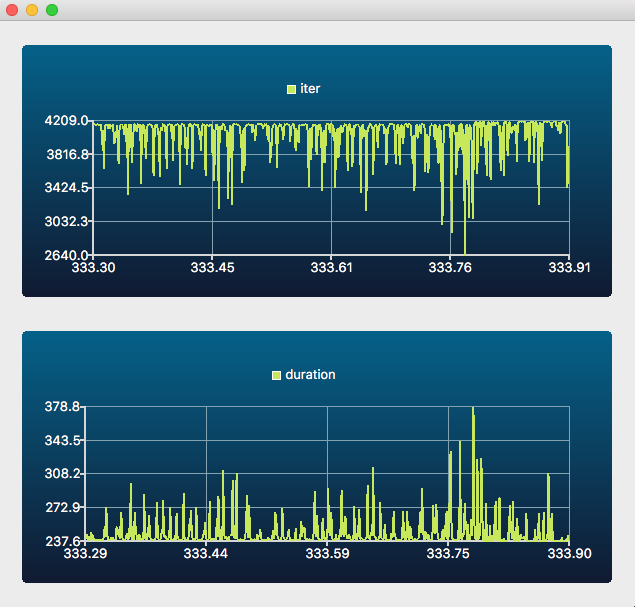
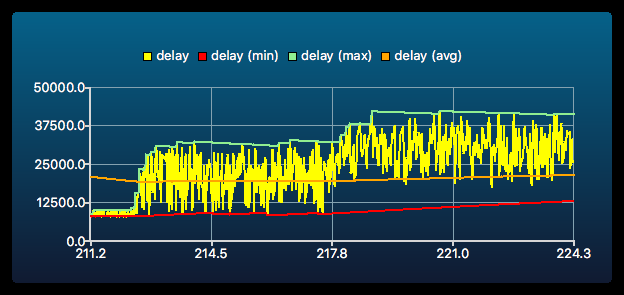

# recorder
A lock-free, real-time flight recorder for your C or C++ programs

* Records information about your program continuously while it's
  running using simple `printf`-like statements
* Classify recorded data in different categories to preserve both old
  important events and recent, rapidly-firing events
* Dump recorded data on demand, notably in response to signals or from debugger
* Can trace specific categories of records, i.e. print them as they happen
* Can export specific data to shared memory channels for external visualization
* A simple Qt5.9-based visualization tool shows content of data
  channels in real-time

## Instrumentation that is always there when you need it

The flight recorder is designed to help you debug complex, real-time,
multi-CPU programs. It lets you instrument their execution with
non-intrusive `printf`-like *record statements*, that capture what is
happening in your program. Here is what a `RECORD` statement looks like:

    RECORD(main, "Program %s started with %d arguments", argv[0], argc);

In that example, `main` is the name of the recorder holding the
data. We can declare it to hold 32 entries with a declaration like:

    RECORDER(main, 32, "This is 'main', used in the example above");

These `RECORD` statements are very inexpensive (less than 0.1
microsecond on a modern PC), so you can leave them in your code all
the time, even for optimized code. See *Performance considerations* at
end of this document for details.

The `RECORD` can also be written in lowercase, as `record`, if you
don't want macros standing out in your regular code. Having two
spellings makes it possible to `#undef` either `RECORD` or `record` in
case of conflict with existing names in your source code.

    record(main, "Program %s started with %d arguments", argv[0], argc);

When something bad happens or from within a debugger, you can
*dump the recorder* by calling the `recorder_dump()` function. This
gives you a very detailed account of recent events, helping you figure
out how you came there. The recorder dump also contains highly
detailed ordering and timing information, which can be very precious
in multi-CPU systems.

Multiple recorders can be active simultaneously, for example to
capture events from different subsystems. When a recorder dump occurs,
events from different recorders are sorted so that you get a picture
of how the systems interacted. Different recorders can have different
size and different refresh rates, but a very fast recorder will not
push away data from a slower one. This ensures that you can record
important, but slow, events, as well as much more frequent ones.

Here is what a recorder dump can look like (lines omitted for brevity):

    recorder.c:518: [0 0.000000] signals: Activating dump for signal mask 0xE3001C58
    recorder_test.c:126: [1 0.000008] MAIN: Launching 16 normal recorder threads
    recorder_test.c:128: [2 0.000045] MAIN: Starting normal speed test for 10s with 16 threads
    recorder_test.c:137: [2392 0.000230] MAIN: Normal recorder testing in progress, please wait about 10s
    recorder_test.c:141: [198750457 9.999914] MAIN: Normal recorder testing completed, stopping threads
    recorder_test.c:98: [198750757 9.999929] SpeedTest: [thread 3] Recording 12448096
    recorder_test.c:98: [198750760 9.999955] SpeedTest: [thread 7] Recording 12527067
    recorder_test.c:147: [198750785 9.999930] Pauses: Waiting for recorder threads to stop, 16 remaining
    recorder_test.c:89: [198750787 9.999946] Pauses: Pausing #0 2401.618us
    recorder_test.c:98: [198750789 10.000008] SpeedTest: [thread 11] Recording 12385726
    recorder_test.c:98: [198750763 9.999929] SpeedTest: [thread 3] Recording 12448097
    recorder_test.c:98: [198750788 9.999971] SpeedTest: [thread 12] Recording 12356775
    recorder_test.c:98: [198750790 10.000029] SpeedTest: [thread 4] Recording 12412805
    recorder_test.c:151: [198750791 10.003075] MAIN: Normal test: all threads have stopped, 198750784 iterations
    recorder_test.c:165: [198750792 10.003117] MAIN: Recorder test complete (Normal version), 16 threads.
    recorder_test.c:166: [198750793 10.003119] MAIN:   Iterations      =  198750784
    recorder_test.c:167: [198750794 10.003121] MAIN:   Iterations / ms =      19875
    recorder_test.c:169: [198750795 10.003122] MAIN:   Record cost     =         50ns

Lines begin with the source code location in the program where the
record was taken. This is optional, and is under control of a recorder
tweak called `recorder_location`. Another tweak, `recorder_functions`,
selects whether that location includes the function name.

The number following the source location is the *order* of records, a
global sequence number that helps relate records made in different
recorders or from different threads. The display of the order can be
configured using the `recorder_order` tweak.

The order is followed by a *timestamp*, which counds the number of
seconds since the start of the program. On 32-bit machines, the
timestamp is precise to the ms. On 64-bit machines, it is precise to
the microsecond. The time stamp can be displayed as absolute time
since midnight using the `recorder_abstime` tweak. The relative
time can be disabled by setting `recorder_reltime` tweak to 0.
With `recorder_abstime=1 recorder_reltime=0`, the recorder dump will
look as follows:

     [11 09:06:16.718056] recorder: Activating tweak 'recorder_abstime' (0x10cba0910)
     [12 09:06:16.718062] recorder: Activating 'MAIN' (0x10cb84148)
     [13 09:06:16.718062] recorder: Activating 'Pauses' (0x10cb851b8)
     [14 09:06:16.718063] recorder: Activating 'Special' (0x10cb89228)
     [15 09:06:16.718063] recorder: Activating 'SpeedTest' (0x10cb8a298)

Finally, the rest of the record is a printout of what was recorded.

The recorder dump is generally sorted according to order and should
show time stamps in increasing order. However, as the example above
shows, this may not always be the case. See *Multithreading
considerations* below for an explanation of what this means.

See [this blog article](https://grenouillebouillie.wordpress.com/2016/12/09/a-real-time-lock-free-multi-cpu-flight-recorder)
for a more extensive description of the design and rationale.

## Building the recorder library

To build and test the recorder library on your system, type:

    make test

This should build the library itself, which really consists of two
headers (`recorder.h` and `recorder_ring.h`) and corresponding C files
(`recorder.c` and `recorder_ring.c`). After building, it will run a
few simple tests that perform some operations and record what is
happening while they do so.

## Adding recorders to your own project

In order to add recorders to your own C project, you need to integrate
four source files:

* The `recorder.h` file is the header, which is designed to work for
  either C programs. That header relies on a supporting `ring.h`
  header to implement ring buffers.

* The `recorder.c` file is the implementation file, which provides
  support for C programs. The `ring.c` file implements functions
  implementing dynamic ring buffers.

To define recorders, you use `RECORDER` statements, which takes
three arguments: the name of the recorder, the number of entries to
keep, and a description. You can look at the `hanoi_test.c` file for
an example of use.  This example defines for example a recorder called
`MOVES` with 1024 entries, declared as follows:

    RECORDER(MOVES, 1024, "Moving pieces around")

It is also possible to declare recorders in a header file using the
`RECORDER_DECLARE` statement that takes the name of the recorder.

    RECORDER_DECLARE(MOVES)

This makes it possible to share a recorder across multiple C source
files. In short, you would typically put `RECORDER` lines in C source
files, and `RECORDER_DECLARE` statements in C header files.

## Recording events

To record events in C, you use a `printf`-like `RECORD` statement,
which begins with the name of the recorder as declared with
`RECORDER_DECLARE` or defined with `RECORDER`. The `RECORD` statement
works mostly like `printf`, but takes a first argument specifying the
name of the recorder:

    record(MOVES, "Move disk from %s to %s\n", name[left], name[right]);

The trailing `\n` in the format string is optional. At recorder dump
time, separate records will always be printed on separate lines.

While a `RECORD` behaves mostly like `printf`, there are important
caveats and limitations to be aware of, see below.

## Caveats and limitations

Each `RECORD` statement can have only up to 12 arguments.
Each individual record can store up to 4 arguments, but the `RECORD`
macro can generate 1, 2 or 3 recorder entries depending on the number
of arguments. If you need more, the changes to the code should be
somewhat straightforward.

You can pass integer values, floating-point values (limited to `float`
on 32-bit machines for size reasons), pointers or strings as `RECORD`
argument.

However, unlike `printf`, the rendering of the final message is done
*at the time of the dump*. This is not a problem for integer,
characters, pointer or floating-point values, but for strings (the
`%s` format of `printf`), this could cause a crash. Therefore, a
string is printed as a pointer at dump time, unless you add the `+`
modifier to the `printf` format, e.g. `"%+s"`. If you know that the
string is a compiler constant, you can use this flag safely.

    // OK if 0 <= i and i < 5, can use the '%+s' format
    const char *array[5] = { "ONE", "TWO", "THREE", "FOUR", "FIVE" };
    record(Main, "Looking at %+s", array[i]);

    // Not OK because the value of the string has been freed at dump time
    char *tempStr = strdup("Hello");
    record(Main, "You will see a pointer at dump time here: %s", tempStr);
    free(tempStr); // At dump time, the string no longer exists

Note that if tracing is enabled for a given recorder, the string will be
printed. If the string is not valid at that time, a crash is possible
during tracing.

The `RECORD` macro automatically converts floating point values
to `uintptr_t` based on their type, i.e. 32-bit or 64-bit floating-point.

## Dumping recorder events

To dump recorded events, you use the `recorder_dump` function. This
dumps all the recorders:

    recorder_dump();

This can be used in a number of situations, in particular from a
debugger. In `gdb` for example, you could run the following command to
dump the recorder during a debugging session:

    p recorder_dump()

If you want to dump specific recorders, you can use
`recorder_dump_for`, which matches the recorder names against the
regular expression given as an argument:

    recorder_dump_for(".*TIMING.*"); // Dumps "TIMING", but also "MY_TIMING_2"

During a dump, events are sorted according to the global event order.
Note that sorting only happens across recorders. Within a single
recorder, events may be out of order, see *Multithreading
considerations* below.

The function `recorder_background_dump(pattern)` launches a background
thread that dumps the recorders selected by `pattern` at regular
interval. The sleep time in milliseconds between recorder dumps is
configured by a recorder tweak named `recorder_dump_sleep`, which
defaults to 100 ms. The background dump can be stopped by calling the
`recorder_background_stop` function.

Recorder output normally goes to standard error `stderr`, although it
is possible to redirect the output using one of the following methods:

* By using the `@output` command, for example from the
 `RECORDER_TRACES` environment variable if your applciation supports
  it,

* By passing a `FILE *` to `recorder_configure_output` in your
  application,

* By replacing the output function entirely using `recorder_configure_show`,
  in which case this function is free to interpret the recorder output
  pointer in any way you wish. Note that doing so disables the
  `@output` command.

## Recorder tracing

In some cases, it is useful to print specific information as you go
instead of after the fact. In this flight recorder, this is called
*tracing*, and can be enabled for each recorder individually.

When tracing for a given recorder is enabled, the trace entries for
that recorder are dumped immediately after being recorded. They are
still stored in the flight recorder for later replay by
`recorder_dump`.

Tracing can be activated by the `recorder_trace_set` function, which
takes a string specifying which traces to activate. The specification
is a colon or space separated list of trace settings, each of them
specifying a regular expression to match recorder names, optionally
followed by an `=` sign and a numerical value. If no numerical value
is given, then the value `1` is assumed.

For example, the trace specification `foo:bar=0:b[a-z]z.*=3` sets the
recorder trace for `foo` to value `1` (enabling tracing for that
recorder), sets the recorder trace for `bar` to `0`, and sets all
recorders with a name matching regular expression `b[a-z]z.*` to
value `3`, for example `boz` and `bbz`.

The following names in a trace specification denote *command* which
perform specific actions.

* The `list` and `help` commands will print the list of available
  recorders on `stderr`.

* The `all` value will be turned into the catch-all `.*`
  regular expression.

* The `output` command will select a file as output for the recorder,
  and the `output_append` variant will append to the given file. For
  example, you can write to `/my/file` using `output=/my/file`.

* The `share` value can be used to set the file name used for sharing
  information in real-time between a recorder appplication and an
  application using that data. Note that another way to achieve the
  same objective is to use the `RECORDER_SHARE` environment variable.

* THe `dump` command causes a recorder dump. This is mostly useful
  over a remote control session, see `recorder_scope` below.

If the name of a command conflicts with the name of a recorder, the
recorder will be selected, and you can force the selection of the
command by prefixing it with `@`. For example, if a recorder is called
`output`, you can still output to a file with `@output=/my/file`.

## Using the `RECORDER_TRACES` and `RECORDER_DUMP` environment variables

If your application calls `recorder_dump_on_common_signals` (see below),
 then traces will be activated or deactivated according to the
`RECORDER_TRACES` environment variable, and background dump can be
 activated according to the `RECORDER_DUMP` environment variable.

Your application can define traces from another application-specific
environment variable with code like:

    recorder_trace_set(getenv("MY_APP_TRACES"));

## Recorder channels

If the specification of the trace is non-numerical, then it defines a
comma-separated list of names of *exported channels*. Data from
exported channels is made available to an external application,
e.g. for real-time display using the `recorder_scope` application.

For example, consider the following `RECORD` statement, taken from the
`recorder_test.c` example:

    record(SpeedInfo, "Iterations per millisecond: %lu (%f ns)",
           k - last_k, 1e6 / (k - last_k));

This `RECORD` statements stores two data elements in the `SpeedInfo`
recorder each time it is executed, a long unsigned value, and a
floating-point value.

It is then possible to cause to export two data channels holding the
values being recorded, under then names `iter` and `duration`, by
using a trace specification such as `SpeedInfo=iter,duration`. For
exampe, you could run the `recorder_test` program as follows (the
`KEEP_RUNNING` environment variable being used to keep the program
running for a long time):

    export KEEP_RUNNING=1
    export RECORDER_TRACES='SpeedInfo=iter,duration'
    export RECORDER_SHARE=/tmp/recorder_share
    ./build/objects/linux/opt/recorder_test 1 1

The data is exported in file `/tmp/recorder_share`. Another program
can be used to display the data exported in that file in
real-time. The `recorder_scope` program in subdirectory `scope` is an
example of such a program. You would run it as follows:

    export RECORDER_SHARE=/tmp/recorder_share
    ./recorder_scope iter duration

The result should be something like the picture below:

While multiple `RECORD` statements can write to the same recorder, if
you intend to export data to channels, the data being exported must
be positionally consistent between record statements, both in terms of
the data type (e.g. integer, floating-point) and in what it
represents. Otherwise, the graphs will not make sense. The data type
for the graphs is taken from the format string for the first `RECORD`
statement exporting data to that channel.

## Recorder trace value

The `RECORDER_TRACE(name)` macro lets you test if the recorder trace
for `name` is activated. The associated value is an `intptr_t`.
Any non-zero value activates tracing for that recorder.

You may set the value for `RECORDER_TRACE` to any value that fits in
an `intptr_t` with `recorder_trace_set`. This can be used for example
to activate special, possibly expensive instrumentation.

For example, to measure the duration and average of a function over N
iterations, you could use code like the following:

    if (RECORDER_TRACE(foo_loops))
    {
        intptr_t loops = RECORDER_TRACE(foo_loops);
        record(foo_loops, "Testing foo() duration");
        uintptr_t start = recorder_tick();
        double sum = 0.0;
        for (int i = 0; i < loops; i++)
            sum += foo();
        uintptr_t duration = recorder_tick() - start;
        record(foo_loops, "Average duration %.3f us, average value %f",
               1e6 * duration / RECORDER_HZ / loops,
               sum / loops);
    }

While this is less-often useful, it is also possible to assign to a
recorder trace value, for example:

    RECORDER_TRACE(foo_loops) = 1000;

A given instrumentation or program behavior may require multiple
configurable options, or *tweaks*. The `RECORDER_TWEAK_DEFINE` defines
a tweak adn its initial value. The `RECORDER_TWEAK` macro accesses the
value of a tweak (at a cost comparable to accessing a global
variable).

    RECORDER_TWEAK_DEFINE(foo_loop, 600, "Number of foo iterations");
    for (int i = 0; i < RECORDER_TWEAK(foo_loops); i++) { foo(); }

# Custom recorder data types

Often, you may have your own custom data types in your program. The
flight recorder has provision for enabling specific format characters
to callback your own code for specific rendering. For example, if
you have a `person` structure defined as:

    typedef struct person { const char *name; unsigned age; } person_t;

You can make it so that the 'P' character denotes a person pointer,
and render it as a 'person'. This would be done by adding a rendering
function of type `recorder_type_fn` for character `P` as follows:

    recorder_configure_type('P', render_person);

where the function `render_person` could be defined as follows:

    size_t render_person(intptr_t tracing,
                         const char *fmt, char *buf, size_t len, uintptr_t data)
    {
        person_t *p = (person_t *) data;
        return tracing
            ? snprintf(buf, len, "person(%s,%u)", p->name, p->age)
            : snprintf(buf, len, "person(%p)", p);
    }

Beware that this will overwrite any regular behaviour 'P' might have
in a printf format, so be careful to use characters that are either
unused by regular `printf`, or at least not used by your own program
(e.g. `%v`, `%E`).

The `tracing` flag contains the trace value for that recorder.
Like for strings, it may be safe to print more information during
tracing than at dump time, as shown in the example above. The lower
bit of the tracing flag will also be set if the `+` modifier was
passed in the format. So if you know that you are passing the address
of a global `person_t` variable, you may use the `"%+P"` format.

## Reacting to signals

It is often desirable to dump the recorder when some specific signal is
received. To detect crashes, for example, you can dump the recorder
when receiving `SIGBUS`, `SIGSEGV`, `SIGILL`, `SIGABRT`, etc. To do
this, call the function `record_dump_on_signal`

    recorder_dump_on_signal(SIGBUS);

When running BSD or macOS, you can have your program dump the current
state of the recorder by adding a signal handler for `SIGINFO`. You
can then dump the recorder at any time by pressing a key (typically
Control-T) in the terminal.

In order to dump the recorder on common signals, the call
`recorder_dump_on_common_signals (0,0)` will install handlers for the
following signals if they exist on the platform:

* `SIGQUIT`
* `SIGILL`
* `SIGABRT`
* `SIGBUS`
* `SIGSEGV`
* `SIGSYS`
* `SIGXCPU`
* `SIGXFSZ`
* `SIGINFO`
* `SIGUSR1`
* `SIGUSR2`
* `SIGSTKFLT`
* `SIGPWR`

The two arguments are bitmask that you can use to add or remove
signals. For instance, if you want to get a recorder dump on `SIGINT`
but none on `SIGSEGV` or `SIGBUS`, you can use:

    unsigned enable = 1U << SIGINT;
    unsigned disable = (1U << SIGSEGV) | (1U << SIGBUS);
    recorder_dump_on_common_signals(enable, disable);

## Performance considerations

The flight recorder `RECORD` statement is designed to cost so little
that you should be able to use it practically anywhere, and in
practically any context, including in signal handlers, interrupt
handlers, etc.

As shown in the data below, a `RECORD` call is faster than a
corresponding call to`snprintf`, because text formatting is only done
at dump time. It is comparable to the cost of a best-case `malloc`
(directly from the free list), and faster than the cost of a typical
`malloc` (with random size).

Most of the cost is actually from keeping track of time, i.e. updating
the `timestamp` field. If you need to instrument the tightest loops in
your code, the `RECORD_FAST` variant can be about twice as fast by
reusing the last time that was recorded in that recorder.

The following figures can help you compare `RECORD` to
various low-cost operations. In all cases, the message being recorded
or printed was the same, `"Speed test %u", i`:

Function                        | Xeon  | Mac   | Pi    | Pi-2  |
--------------------------------|-------|-------|-------|-------|
`record_fast`                   |  20ns |  20ns | 129ns |  124ns|
`record`                        |  35ns |  64ns |1070ns |  726ns|
`gettimeofday`                  |  16ns |  36ns | 913ns |  675ns|
`memcpy` (512 bytes)            |  26ns |  15ns |1669ns |  499ns|
`malloc` (512 bytes)            |  40ns |  61ns | 603ns |  499ns|
`snprintf`                      |  64ns |  98ns |2530ns | 1071ns|
`fprintf`                       |  64ns |  14ns |4840ns | 2318ns|
Flushed `fprintf`               | 751ns |1334ns |4509ns |14730ns|
`malloc` (512-4K jigsaw)        | 508ns | 483   |3690ns | 5466ns|
Hanoi 20 (printing piped to wc) | 320ms | 180ms |19337ms| 7110ms|
Hanoi 20 (recording)            |  60ms |  60ms | 1203ms|  834ms|
Hanoi 20 (fast recording)       |  23ms |  24ms |  262ms|  175ms|

Scalability depending on number of threads

Function                    | Xeon  | Mac   | Pi    | Pi-2  |
----------------------------|-------|-------|-------|-------|
`record_fast` * 1           |  20ns | 21ns  | 137ns | 133ns |
`record_fast` * 2           |  92ns | 86ns  | 137ns | 110ns |
`record_fast` * 4           |  94ns | 76ns  | 137ns | 152ns |
`record_fast` * 8           |  57ns | 55ns  | 137ns | 152ns |
`record_fast` * 16          |  52ns | 52ns  | 137ns | 152ns |
`record_fast` * 32          |  52ns | 54ns  | 137ns | 152ns |
`record` * 1                |  37ns | 60ns  |1315ns | 742ns |
`record` * 2                |  97ns | 93ns  |1076ns | 412ns |
`record` * 4                |  95ns | 71ns  |1080ns | 224ns |
`record` * 8                |  59ns | 54ns  |1083ns | 224ns |
`record` * 16               |  54ns | 50ns  |1084ns | 224ns |
`record` * 32               |  54ns | 53ns  |1372ns | 224ns |

The platforms that were tested are:

* Xeon: a 6-CPU (12-thread) Intel(R) Xeon(R) CPU E5-1650 v4 @ 3.60GHz
  running Fedora 26 Linux kernel, GCC 7.1.1

* Mac: a 4-CPU (8-thread) 2.5GHz Intel Core i7 MacBook Pro (15'
  Retina, mid 2015), Xcode 8.1.0 clang

* Pi: First generation Raspberry Pi, ARMv6 CPU, running Raspbian Linux
  with kernel 4.4.50, GCC 4.9.2

* Pi-2: Second generation Raspberry Pi, 4-way ARMv7 CPU, running
  Raspbian Linux with kernel 4.4.50, GCC 4.9.2

## Multithreading considerations

The example of recorder dump given at the beginning of this document
shows record entries that are printed out of order, and with
non-monotonic time stamps.

Here is an example of non-monotonic timestamp (notice that time for
thread 7 is ahead of time for thread 3 and thread 15):

    recorder_test.c:98: [198750757 9.999929] SpeedTest: [thread 3] Recording 12448096
    recorder_test.c:98: [198750760 9.999955] SpeedTest: [thread 7] Recording 12527067
    recorder_test.c:98: [198750758 9.999929] SpeedTest: [thread 15] Recording 12379912

Here is an example of the entries being out of order (notice that the
order ending in 80 is between those ending in 78 and 79):

    recorder_test.c:98: [198750778 9.990261] SpeedTest: [thread 2] Recording 12374034
    recorder_test.c:98: [198750780 9.999930] SpeedTest: [thread 8] Recording 12446849
    recorder_test.c:98: [198750779 9.999930] SpeedTest: [thread 15] Recording 12379916

This is normal behaviour under heavy load, but requires an
explanation. The `record` statements can be performed simultaneously
from multiple threads. If there is "contention", i.e. if multiple CPUs
are attempting to write at the same time, one CPU may acquire its
order and timestamp *before* another CPU, but may end up writing the
record *after* that other CPU. The same thing may also happen if the
operating system suspends a thread while it is writing the record, in
which case a timestamp discrepancy of several milliseconds may appear
between nearby records.

In general, this should have a minimal impact on the understanding of
what is happening, and may help you pinpoint risks of race condition
in your code.

## Recorder scope

The recorder scope application, `recorder_scope`, shows real-time graphs
of selected `record` statements in your program.

The `recorder_scope` application is not built by default.  In order to
build it, you need Qt5 and Qt5 Charts. You can then build it using
`make scope` from the top-level.

The `recorder_scope` application uses the recorder API to remotely access
a program being monitored. This communication happens over shared memory,
using a file specified in the `RECORDER_SHARE` environment variable.
That value needs to be the same for both the program being monitored and
the matching `recorder_scope` program. By default, the file name is
`/tmp/recorder_share`.

### Command-line arguments

The `recorder_scope` application takes the following command-line arguments:

* A channel-regexp to match exported channels. Each channel-regexp builds
  a new graph, and graphs show stacked in a single window. If you want
  multiple windows for the same channel, you can run multiple instances
  of `recorder_scope`.

* `-c config` sends the given recorder configuration to the program
  being monitored. It is equivalent to adding the given configuration
  commands to the `RECORDER_TRACES` environment variable.

* `-s name=init:min:max` creates a slider with a value that can be set
  between `min` and `max` and starts at `init`. This slider then sends
  configuration commands to the `name` tweak. This can be used to
  adjust parameters in the monitored program on the fly.

* `-d delay` sets the number of seconds that can be shown at once on
  screen.  This is useful for example if the sampling rate for the
  events is not regular.

* `-w samples` sets the number of samples that can be displayed.  The
  default is 0, which corresponds to the width of the window. Using a
  larger value makes it possible to show more data, but at the expense
  of performance and, in some cases, readability of the data.

* `-t` toggles the display of a time graph for the following graphs. The
  time graph is an additional graph showing timing information about
  the event being recorded. It is drawn on a microseconds scale that shows
  on the right of the graph.
  

* `-m` toggles the display of a min/max values graph for the following
   graphs
   

* `-a` toggles the display of the average value for the following graphs

* `-n` toggles the display of the normal value for the following graphs,
  which is useful if you want to remove it from display for clarity.

* `-r ratio` sets the rolling average ratio used for `-m` and `-a` options.
  It is a percentage, and should be set relatively high. The default is
  `-r 99`, which means that a new sample changes the average by 1% only.

* `-s basename` sets the basename when saving data. The default is
  `recorder_scope_data-`. Hitting the `i` key saves an image of the
  current graph (i.e. the graph with the focus). Hitting the `c` key
  saves a CSV file with the currently displayed values. Hitting the
  space bar saves both a file and CSV data. Files are numbered
  incrementally so as to not overwrite an existing file. When hitting
  the space bar, the same number will be used for both the image and
  CSV file.

* `-g WxH` sets the window geometry to WxH pixels.

* `-g WxH@XxY` sets the window geometry to WxH pixels and the window
  position to X,Y.

In the recorder scope window, hitting the `t`, `a`, `n` or `m` key
toggles the corresponding setting (timing, average, normal and min/max views).

### Example

For example, run the `recorder_test` program with:

    RECORDER_TRACES='SpeedTest=tid,value,mod,delay' ./recorder_test_test 1 1000

THen run the `recorder_scope` with:

    recorder_scope                      \
        -s sleep_time=0:0:100000        \
        -s sleep_time_delta=0:0:100000  \
        -t mod                          \
        -m -a -t delay

This will open a window that looks like the following:

### Sliders to adjust tweaks

You can then adjust the waiting time for the program being run
dynamically using the two sliders. They will update the values of the
two recorder tweaks defined in `recorder_test.c` as follows:

    RECORDER_TWEAK_DEFINE(sleep_time, 0, "Sleep time between records");
    RECORDER_TWEAK_DEFINE(sleep_time_delta, 0, "Variations in sleep time between records");

In that specific case, the tweaks adjust the wait time in the
following code in `recorder_test.c`:

   if (RECORDER_TWEAK(sleep_time))
   {
       struct timespec tm;
       uint64_t wait_time = (uint64_t)
           (RECORDER_TWEAK(sleep_time) + drand48()*RECORDER_TWEAK(sleep_time_delta));
       tm.tv_sec  = 0;
       tm.tv_nsec = wait_time * 1000;
       nanosleep(&tm, NULL);
   }

### Graphing

The `RECORDER_TRACES` has indicated that you want to share the
`SpeedTest` record as four columns, named `tid`, `value`, `mod` and
`delay`. These corresponds to the four arguments in the following
`record` in the `recorder_test.c` program:

        record(SpeedTest, "[thread %u] Recording %u, mod %u after
 %ld",
            tid, i, i % 500, current_time - last_time);

### Derived values (min, max, average, timing)

The `recorder_scope` will then graph the `mod` and `delay` columns in
two separate graphs. Since we have activated timing before `mod`,
the `recorder_scoope` will show timing information in the `mod` graph.
Similaryl, since we have activated min/max and average, and then
toggled timing off by using `-t` a second time, the `delay` graph will
show min, max and average value, but not timing.
